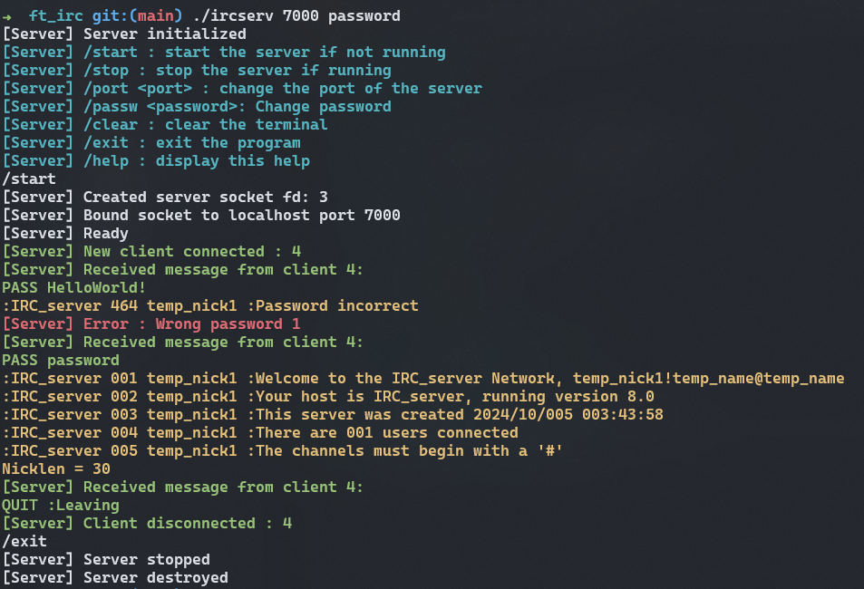

# ft_irc ✅97/100
An IRC server

I've done this project with :
  - [Tuvosyl](https://github.com/tuvosyl)
  - [Ratsock6](https://github.com/Ratsock6)

#

To create your own IRC server, run these commands :
```shell
# Create the executable
make

# Run the executable
./ircserv <port> <server-password>

# You will get into a menu where you can change the server settings
# If you want to create a server run this command :
/start
```

You have also these makefile commands :
```shell
# Clean all object files (*.o)
make clean

# Clean static library & object files
make fclean

# Clean everything and recompile the static library
make re

# Create the executable in debug mode
make debug
```

#
### Message Color Chart :
  - White : Server creation/destruction notice
  - Blue : Commands tips
  - Green : Message received from clients
  - Yellow : Message sent by the server
  - Red : Error or very specific interaction notice
  

